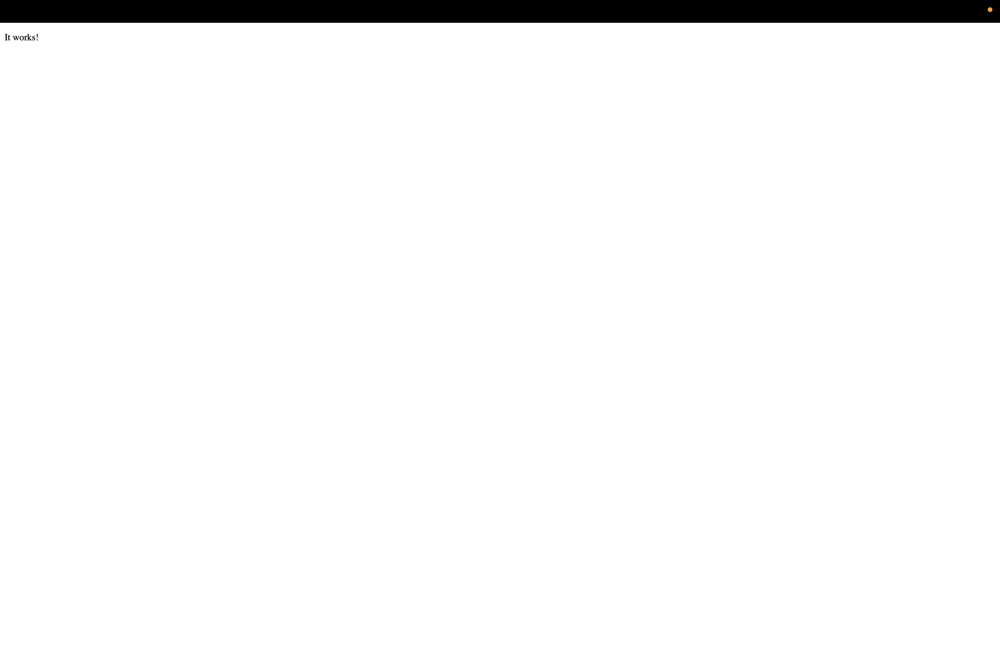

# Secure Automated Web Architecture

## Description
This project provisions a secure, publicly accessible web server on AWS using Terraform, with an automated CI/CD pipeline that scans every code change for security vulnerabilities before deployment. It demonstrates infrastructure as code, DevSecOps pipeline integration, and secure network design from a blank canvas to a live, production-style deployment.

## Live Deployment Proof


The Apache/Nginx default test page confirms the EC2 instance's `user_data` bootstrap script executed successfully and the security group correctly permits inbound HTTP traffic.

## Technologies Used
- **AWS** (VPC, EC2, Security Groups, IAM)
- **Terraform** (Infrastructure as Code)
- **GitHub Actions** (CI/CD automation)
- **tfsec** (Static Application Security Testing / SAST)

## Architecture
The infrastructure runs inside a custom VPC (`10.0.0.0/16`) with a single public subnet (`10.0.1.0/24`) routed to the internet through an Internet Gateway. A security group restricts inbound access to only what's required: port 80 (HTTP) is open to the public to serve web traffic, while port 22 (SSH) is locked to a single trusted IP address rather than the open internet. The EC2 instance itself is hardened with IMDSv2 token enforcement (preventing unauthenticated metadata access) and an encrypted root volume. Every change to this configuration is automatically scanned by tfsec via GitHub Actions before it's considered safe to merge — the pipeline physically fails the build if new vulnerabilities are introduced, and any accepted risk (such as the intentionally public HTTP port) is documented directly in the code with justification rather than silently ignored.

## Deployment
Infrastructure is deployed via:
```bash
terraform init
terraform validate
terraform apply -auto-approve
```

## Security Notes
This repository enforces a DevSecOps quality gate (`.github/workflows/security-scan.yml`) that runs `tfsec` on every push to `main`. All findings were either remediated (IMDS token requirement, root volume encryption, security group rule descriptions) or explicitly accepted and documented in-line where required by the project scope (public HTTP ingress/egress, public subnet IP assignment).